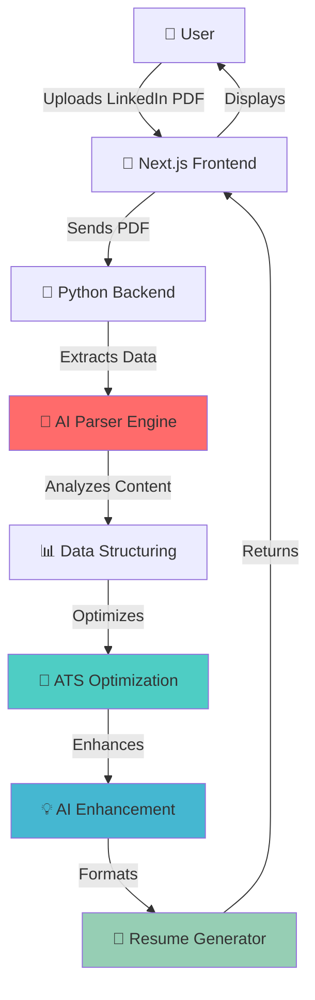

<div align="center">

# 📄 ResuMate

**Transform Your LinkedIn Profile into an Interview-Winning Resume in Seconds**

[](https://www.typescriptlang.org/)
[](https://nextjs.org/)
[](https://www.python.org/)
[](https://tailwindcss.com/)
[](https://openai.com/)

*Upload your LinkedIn PDF → Get a professionally optimized, ATS-friendly resume in seconds*

[✨ See It In Action](#-how-it-works) • [🚀 Features](#-features) • [💻 Get Started](#-getting-started) • [🏆 Why ResuMate?](#-why-resumate)

</div>

---

## 🎯 What is ResuMate?

**ResuMate is your intelligent career companion that bridges the gap between your LinkedIn profile and your dream job.**

Simply export your LinkedIn profile as a PDF, upload it to ResuMate, and watch the magic happen: 

```
LinkedIn PDF → AI-Powered Analysis → Professionally Formatted Resume → Interview Success!  🎉
```

No more spending hours reformatting your experience.  No more wondering if your resume will pass ATS filters. ResuMate does the heavy lifting, so you can focus on landing that dream job.

---

## ✨ How It Works

<div align="center">

### 🔮 The ResuMate Magic in 3 Steps

</div>

1. **📤 Upload Your LinkedIn PDF**
   - Export your LinkedIn profile as PDF (Profile → More → Save to PDF)
   - Drag and drop it into ResuMate's sleek interface
   - Our AI instantly begins analyzing your profile

2. **🧠 AI-Powered Intelligence Does Its Magic**
   - Extracts your experience, skills, education, and achievements
   - Analyzes industry-specific keywords and ATS requirements
   - Restructures content for maximum impact
   - Optimizes formatting for both human recruiters and ATS systems

3. **🎨 Get Your Interview-Ready Resume**
   - Receive a professionally formatted, ATS-optimized resume
   - Review AI-powered suggestions to enhance impact
   - Download in multiple formats
   - Apply with confidence! 

---

## 🏆 Why ResuMate? 

<table>
<tr>
<td width="50%">

### 😩 Without ResuMate
- ⏰ Hours spent reformatting
- ❌ Resumes rejected by ATS
- 🤔 Guessing what keywords to include
- 📝 Manually typing everything
- 😰 Uncertainty about resume quality

</td>
<td width="50%">

### 🚀 With ResuMate
- ⚡ Instant transformation in seconds
- ✅ ATS-optimized automatically
- 🎯 AI-selected industry keywords
- 🤖 Intelligent auto-extraction
- 💪 Confidence in your application

</td>
</tr>
</table>

---

## 🌟 Features

### Core Features

- 📤 **LinkedIn PDF Upload** - Seamless drag-and-drop interface for your LinkedIn profile PDF
- 🧠 **AI-Powered Extraction** - Intelligent parsing of your entire professional history
- 🎨 **Professional Formatting** - Industry-standard resume layouts that recruiters love
- 🔍 **ATS Optimization** - Ensure your resume passes Applicant Tracking Systems every time
- 📊 **Interactive Dashboard** - Beautiful visualization of your parsed information
- ⚡ **Lightning Fast** - Get your resume in seconds, not hours

### Smart Features

- 💡 **AI Recommendations** - Get intelligent suggestions to strengthen your resume
- 🎯 **Keyword Optimization** - Automatically includes relevant industry keywords
- 📈 **Impact Enhancement** - AI rewrites to make your achievements stand out
- 🔄 **Multiple Export Formats** - Download as PDF, DOCX, or TXT
- 🎨 **Multiple Templates** - Choose from professional, modern, or minimalist designs
- 📱 **Responsive Design** - Works perfectly on desktop, tablet, and mobile

---

## 🛠️ Tech Stack

<div align="center">

**Built with cutting-edge technologies for maximum performance and reliability**

</div>

### Frontend
- **Framework**: [Next.js 16](https://nextjs.org/) - The React framework for production-grade apps
- **Language**: [TypeScript](https://www.typescriptlang.org/) - Type-safe, scalable JavaScript
- **Styling**: [TailwindCSS v4](https://tailwindcss.com/) - Modern utility-first CSS
- **PDF Rendering**: [react-pdf](https://github.com/wojtekmaj/react-pdf) - Seamless PDF display
- **Icons**: [Lucide React](https://lucide.dev/) - Beautiful, consistent iconography
- **Animations**:  Smooth, professional transitions for enhanced UX

### Backend
- **Language**: Python 3.8+
- **AI Processing**: Advanced NLP and machine learning models
- **PDF Parsing**: Intelligent document structure recognition
- **Data Extraction**: Pattern recognition for skills, experience, and achievements
- **Optimization Engine**: ATS-compliance and keyword density analysis

### Architecture
- **Modern Stack**:  Serverless-ready, scalable architecture
- **API Design**: RESTful endpoints for seamless integration
- **Performance**: Optimized for speed with caching and lazy loading
- **Security**: Secure file handling and data privacy

---

## 🚀 Getting Started

### Prerequisites

```bash
Node.js 20+ | Python 3.8+ | Git
```

### Quick Start (5 minutes)

1. **Clone the repository**
   ```bash
   git clone https://github.com/artisticshashank/ResuMate.git
   cd ResuMate
   ```

2. **Frontend Setup**
   ```bash
   cd frontend
   npm install        # or yarn install / pnpm install
   npm run dev
   ```
   🌐 Frontend runs at [http://localhost:3000](http://localhost:3000)

3. **Backend Setup** (in a new terminal)
   ```bash
   cd backend
   pip install -r requirements.txt
   python prototype_extract.py
   ```
   🔧 Backend ready and processing! 

4. **Start Creating Magic** ✨
   - Open [http://localhost:3000](http://localhost:3000)
   - Upload your LinkedIn PDF
   - Watch ResuMate work its magic!

---

## 📁 Project Structure

```
ResuMate/
├── frontend/                    # Next.js Frontend Application
│   ├── app/                     # Next.js 16 App Router
│   ├── components/              # Reusable React Components
│   │   ├── UploadZone/         # LinkedIn PDF upload interface
│   │   ├── ResumePreview/      # Resume preview component
│   │   ├── Dashboard/          # Data visualization dashboard
│   │   └── ExportOptions/      # Download and export features
│   ├── lib/                    # Utility functions and helpers
│   ├── styles/                 # Global styles and Tailwind config
│   ├── public/                 # Static assets and images
│   └── package.json            # Frontend dependencies
│
├── backend/                    # Python Backend & AI Engine
│   ├── app/                    # Core application logic
│   │   ├── parsers/           # LinkedIn PDF parsing modules
│   │   ├── ai_engine/         # AI optimization and enhancement
│   │   └── formatters/        # Resume formatting logic
│   ├── models/                # AI models and training data
│   ├── templates/             # Resume templates
│   ├── prototype_extract.py   # Main extraction engine
│   └── requirements.txt       # Python dependencies
│
├── docs/                      # Documentation
├── tests/                     # Test suites
└── README.md                  # You are here!  📍
```

---

## 🏗️ Architecture



---

## 🎯 Roadmap

### 🚀 Coming Soon
- [ ] 📑 **Multiple Template Designs** - Choose from 10+ professional layouts
- [ ] 🎨 **Custom Branding** - Add your personal color schemes and styling
- [ ] 🌍 **Multi-Language Support** - Resumes in 20+ languages
- [ ] 📧 **Cover Letter Generator** - AI-powered cover letters from your profile
- [ ] 🔗 **Direct LinkedIn Integration** - No PDF needed, just connect your account

### 🔮 Future Vision
- [ ] 🤝 **Job Matching Algorithm** - Find jobs that match your resume
- [ ] 📊 **Resume Analytics** - Track views, downloads, and effectiveness
- [ ] 🔄 **Version Control** - Maintain multiple resume versions for different roles
- [ ] 🎓 **Skill Gap Analysis** - Identify skills to learn for your dream job
- [ ] 🤖 **Interview Prep** - AI-generated interview questions based on your resume
- [ ] 🏢 **Company-Specific Optimization** - Tailor resumes for specific companies

---

## 💼 Use Cases

<div align="center">

| 👨‍🎓 Recent Graduates | 🔄 Career Changers | 💼 Professionals | 🚀 Job Seekers |
|: ---:|:---:|:---:|:---:|
| Transform your LinkedIn into a professional resume instantly | Reposition your experience for a new industry | Keep your resume updated effortlessly | Apply faster with optimized resumes |

</div>

---

## 🤝 Contributing

We love contributions! ResuMate is open source and thrives on community input. 

### How to Contribute

1. 🍴 **Fork** the Project
2. 🌿 **Create** your Feature Branch 
   ```bash
   git checkout -b feature/AmazingFeature
   ```
3. ✍️ **Commit** your Changes 
   ```bash
   git commit -m 'Add some AmazingFeature'
   ```
4. 📤 **Push** to the Branch 
   ```bash
   git push origin feature/AmazingFeature
   ```
5. 🎉 **Open** a Pull Request

### Contribution Ideas
- 🐛 Bug fixes and improvements
- ✨ New features and enhancements
- 📚 Documentation improvements
- 🎨 UI/UX enhancements
- 🌍 Translations and localization
- 🧪 Test coverage improvements

Check out our [issues page](https://github.com/artisticshashank/ResuMate/issues) for good first issues! 

---

## 📝 License

This project is licensed under the **MIT License** - see the [LICENSE](LICENSE) file for details.

**TL;DR**: Free to use, modify, and distribute. Just give credit!  🙏

---

## 👨‍💻 Author

<div align="center">

**Shashank** - *Creator & Lead Developer*

[](https://github.com/artisticshashank)
[](https://linkedin.com/in/artisticshashank)

*"Building tools that empower people to land their dream jobs"* 💼✨

</div>

---

## 🌟 Show Your Support

If ResuMate helped you land an interview (or a job! ), please:

- ⭐ **Star this repository** - It helps others discover the project
- 🐛 **Report bugs** - Help us improve
- 💡 **Suggest features** - Tell us what you need
- 📢 **Share with friends** - Help others in their job search
- ☕ **Buy me a coffee** - Fuel further development

---

## 📊 Stats

<div align="center">


</div>

---

## 🎓 Testimonials

> *"ResuMate transformed my LinkedIn profile into a stunning resume in seconds. I got 3 interview calls within a week!"*  
> **- Sarah M., Software Engineer**

> *"The ATS optimization feature is a game-changer. My resume finally gets past the filters!"*  
> **- David K., Product Manager**

> *"As a recent graduate, ResuMate helped me create a professional resume without any experience in resume writing."*  
> **- Priya S., Fresh Graduate**

---

## 🔗 Resources

- 📖 [Documentation](https://github.com/artisticshashank/ResuMate/wiki) - Comprehensive guides
- 🎥 [Video Tutorial](https://youtube.com/watch?v=resumate) - Watch it in action
- 💬 [Community Discord](https://discord.gg/resumate) - Get help and share tips
- 🐦 [Twitter Updates](https://twitter.com/resumate) - Stay updated with latest features

---

<div align="center">

### 🚀 Ready to Transform Your Career? 

**[Get Started Now →](https://github.com/artisticshashank/ResuMate)**

---

Made with ❤️, ☕, and countless iterations by the ResuMate Team

**ResuMate** - *Because your career deserves the best start*

⭐ **Star us on GitHub** — it motivates us to keep improving!

</div>
