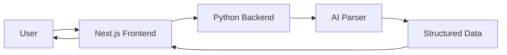

<div align="center">

# 📄 ResuMate

**Your AI-Powered Resume Companion**

[](https://www.typescriptlang.org/)
[](https://nextjs.org/)
[](https://www.python.org/)
[](https://tailwindcss.com/)

*Transform your resume game with intelligent parsing, analysis, and optimization*

[Features](#-features) • [Tech Stack](#-tech-stack) • [Getting Started](#-getting-started) • [Architecture](#-architecture) • [Contributing](#-contributing)

</div>

---

## 🌟 Overview

**ResuMate** is a cutting-edge resume management platform that leverages AI to extract, analyze, and optimize your resume content. Whether you're a job seeker looking to perfect your CV or a recruiter managing hundreds of applications, ResuMate streamlines the entire process.

## ✨ Features

- 📤 **Smart Resume Upload** - Drag-and-drop interface for PDF resume uploads
- 🔍 **Intelligent Parsing** - AI-powered extraction of key information from resumes
- 📊 **Data Visualization** - Beautiful, interactive display of parsed resume data
- 🎯 **ATS Optimization** - Ensure your resume passes Applicant Tracking Systems
- 💡 **Smart Suggestions** - Get AI-powered recommendations to improve your resume
- 🎨 **Modern UI** - Sleek, responsive design built with TailwindCSS
- ⚡ **Lightning Fast** - Optimized performance with Next.js 16

## 🛠️ Tech Stack

### Frontend
- **Framework**: [Next.js 16](https://nextjs.org/) - React framework for production
- **Language**: [TypeScript](https://www.typescriptlang.org/) - Type-safe JavaScript
- **Styling**: [TailwindCSS v4](https://tailwindcss.com/) - Utility-first CSS framework
- **PDF Rendering**: [react-pdf](https://github.com/wojtekmaj/react-pdf) - Display PDF documents in React
- **Icons**: [Lucide React](https://lucide.dev/) - Beautiful & consistent icons

### Backend
- **Language**: Python
- **Framework**: Custom extraction pipeline
- **Processing**: AI-powered text extraction and analysis

## 🚀 Getting Started

### Prerequisites

- **Node.js** 20+ and npm/yarn/pnpm
- **Python** 3.8+
- Git

### Installation

1. **Clone the repository**
   ```bash
   git clone https://github.com/artisticshashank/ResuMate.git
   cd ResuMate
   ```

2. **Frontend Setup**
   ```bash
   cd frontend
   npm install
   # or
   yarn install
   # or
   pnpm install
   ```

3. **Backend Setup**
   ```bash
   cd backend
   pip install -r requirements.txt
   ```

### Running the Application

#### Frontend Development Server
```bash
cd frontend
npm run dev
```
Visit [http://localhost:3000](http://localhost:3000) to see the application.

#### Backend Server
```bash
cd backend
python prototype_extract.py
```

## 📁 Project Structure

```
ResuMate/
├── frontend/              # Next.js frontend application
│   ├── components/        # Reusable React components
│   ├── pages/            # Next.js pages and API routes
│   ├── styles/           # Global styles and Tailwind config
│   ├── public/           # Static assets
│   └── package.json      # Frontend dependencies
│
├── backend/              # Python backend
│   ├── app/             # Core application logic
│   ├── templates/       # Template files
│   └── prototype_extract.py  # Resume extraction prototype
│
└── README.md            # You are here!
```

## 🏗️ Architecture



## 🎯 Roadmap

- [ ] Multi-format support (DOCX, TXT)
- [ ] Resume templates and builder
- [ ] Job matching algorithm
- [ ] Cover letter generation
- [ ] Multi-language support
- [ ] Resume comparison tool
- [ ] Export to multiple formats

## 🤝 Contributing

Contributions, issues, and feature requests are welcome! Feel free to check [issues page](https://github.com/artisticshashank/ResuMate/issues).

1. Fork the Project
2. Create your Feature Branch (`git checkout -b feature/AmazingFeature`)
3. Commit your Changes (`git commit -m 'Add some AmazingFeature'`)
4. Push to the Branch (`git push origin feature/AmazingFeature`)
5. Open a Pull Request

## 📝 License

This project is open source and available under the [MIT License](LICENSE).

## 👨‍💻 Author

**Shashank**
- GitHub: [@artisticshashank](https://github.com/artisticshashank)

## 🌟 Show your support

Give a ⭐️ if this project helped you!

---

<div align="center">

Made with ❤️ and ☕ by the ResuMate team

</div>